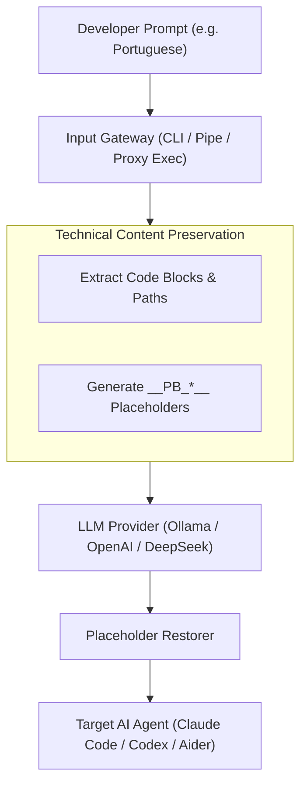

# PromptBridge

> **Translate and optimize developer prompts for AI coding agents transparently while 100% preserving code, file paths, CLI flags, logs, and technical terms.**

PromptBridge is a CLI-agnostic Rust gateway designed for developers using AI Coding Agents (such as **Claude Code**, **Codex**, **OpenCode**, **Aider**, **GitHub Copilot CLI**, **Ollama**, and **mods**).

---

## Features

- **100% CLI-Agnostic Proxy Gateway (`promptbridge exec`)**: Seamlessly wraps any terminal AI agent. Set a shell alias once and use your native language natively.
- **Technical Content Preservation**: Automatically extracts fenced code blocks (```...```), inline code (`...`), file paths (`src/api.rs`), stack traces, and terminal flags into safe placeholders (`__PB_*__`) before LLM invocation and restores them post-transformation.
- **Modular LLM Provider Abstraction**: Easily swap backends between **Ollama (local models)**, **OpenAI-compatible APIs (OpenAI, DeepSeek, Groq, Together, LM Studio)**, or a **Mock Provider (dry-run mode)**.
- **Dual Display Modes**:
  - **Preview Mode**: Visually updates the transformed prompt in the agent TUI.
  - **Silent Mode**: Transparently passes the transformed prompt directly to the backend.
- **Clipboard Integration**: Automatically copy results to system clipboard (`--copy`).

---

## Architecture



---

## Installation & Distribution

Choose your preferred installation method:

### 1. Via Cargo / Crates.io (Recommended for Rust users)

```bash
cargo install promptbridge
```

Or install from source repository:
```bash
git clone https://github.com/pedroaugusto04/PromptBridge.git
cd PromptBridge
cargo install --path .
```

### 2. Standalone Pre-Compiled Binaries (No dependencies required)

Automated binary releases are generated for every release tag via GitHub Actions:
- **Windows**: `promptbridge-x86_64-pc-windows-msvc.zip`
- **Linux**: `promptbridge-x86_64-unknown-linux-gnu.tar.gz`
- **macOS (Apple Silicon M1/M2/M3)**: `promptbridge-aarch64-apple-darwin.tar.gz`

Download the matching binary from **GitHub Releases**, extract it, and add it to your system PATH.

### 3. Via Homebrew / Scoop (Package Managers)

```bash
# Homebrew (macOS / Linux)
brew install pedroaugusto04/tap/promptbridge

# Scoop (Windows)
scoop bucket add promptbridge https://github.com/pedroaugusto04/PromptBridge
scoop install promptbridge
```

---

## Quick Start & Transparent Setup

### Configure Shell Aliases (Set it and Forget it)

#### Linux / macOS (Bash & Zsh)
Add the following aliases to your shell profile (e.g. `~/.bashrc` or `~/.zshrc`):

```bash
alias claude="promptbridge exec -- claude"
alias codex="promptbridge exec -- codex"
alias opencode="promptbridge exec -- opencode"
alias aider="promptbridge exec -- aider"
```

#### Windows (PowerShell)
In PowerShell, standard aliases don't support arguments. Instead, you need to add functions to your profile (`$PROFILE`).
Open your profile (`notepad $PROFILE`) and add:

```powershell
function claude { promptbridge exec -- claude @args }
function codex { promptbridge exec -- codex @args }
function opencode { promptbridge exec -- opencode @args }
function aider { promptbridge exec -- aider @args }
```

---

## Daily Workflow

Once the aliases are configured, **you will never need to call `promptbridge` directly**. You just use your AI agents normally, but now you can speak to them in your native language without worrying about it.

Here is how your day-to-day will look:

1. You open your terminal and type your normal agent command:
   ```bash
   claude "Crie um teste unitário para o arquivo src/api.rs"
   ```
2. Because of the alias, **PromptBridge** intercepts this transparently.
3. PromptBridge parses `src/api.rs`, protects it, and translates your prompt to English (e.g., *"Create a unit test for the file __PB_PATH_1__"*).
4. PromptBridge silently passes this optimized prompt to the actual `claude` CLI.
5. Claude processes it, generates the code, and answers you. 

---

## CLI Usage Examples (Manual Mode)

### Direct Transformation
```bash
promptbridge transform "Refatore a função fetch_user em src/controllers/user.rs para usar tokio"
```

### Piping via StdIn & Clipboard Copy
```bash
cat prompt.md | promptbridge transform --copy
```

### Dry-Run Verification (Offline Testing)
```bash
promptbridge transform "Se o método parse_headers em src/http.rs falhar, lance erro" --dry-run
```

---

## Configuration (`promptbridge.toml` or `.env`)

Create a `promptbridge.toml` file locally or in `~/.config/promptbridge/config.toml`, or use environment variables (`.env`):

```toml
[general]
default_provider = "ollama"
target_language = "en"
mode = "preview"
auto_copy_clipboard = false
preserve_technical_terms = true
request_timeout_seconds = 30

[providers.ollama]
type = "ollama"
base_url = "http://localhost:11434"
model = "llama3.2"
temperature = 0.2

[providers.openai]
type = "openai"
base_url = "https://api.openai.com/v1"
api_key = "env:OPENAI_API_KEY"
model = "gpt-4o-mini"
temperature = 0.2

[providers.deepseek]
type = "openai"
base_url = "https://api.deepseek.com/v1"
api_key = "env:DEEPSEEK_API_KEY"
model = "deepseek-coder"
temperature = 0.2
```

---

## Testing

Run the automated test suite for all business rules:

```bash
cargo test
```

- `parser_tests`: Validates technical term preservation and placeholder restoration.
- `pipeline_tests`: Validates prompt transformation pipeline.
- `provider_tests`: Validates LLM abstraction layer & mock provider.
- `config_tests`: Validates configuration precedence hierarchy.

---

## License

MIT License. See [LICENSE](LICENSE) for details.
